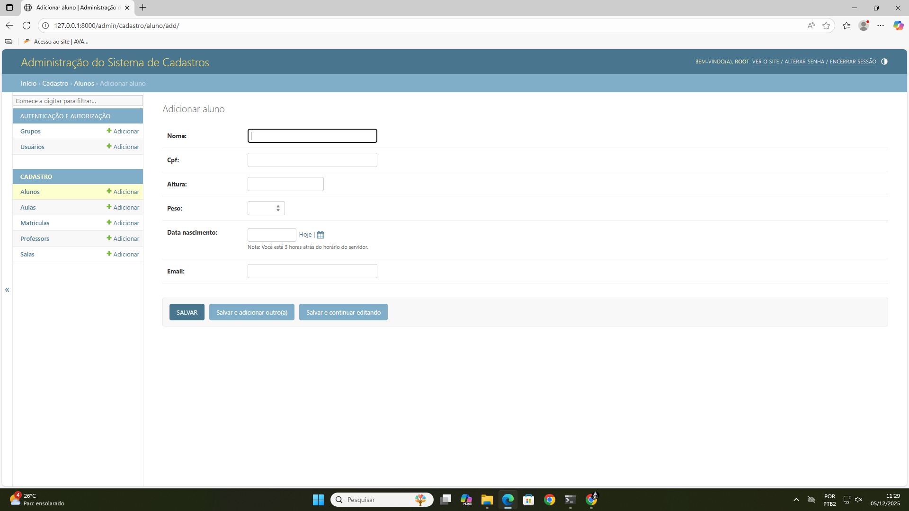
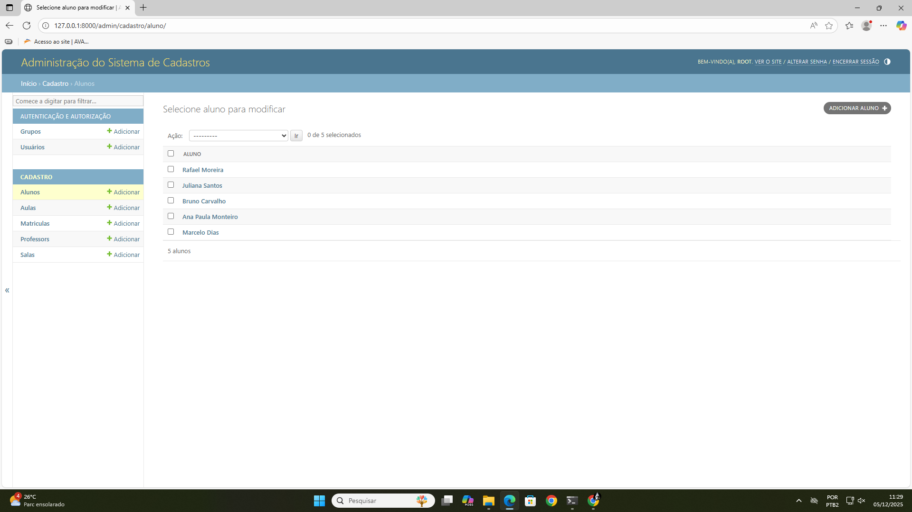
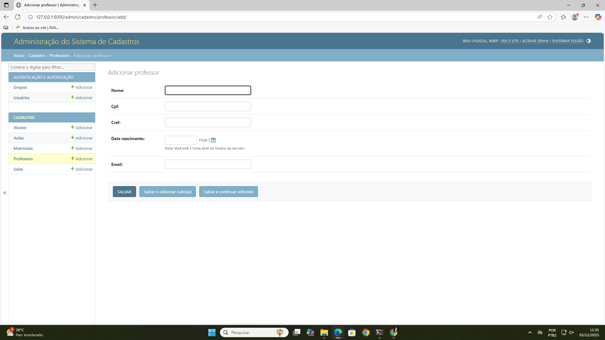
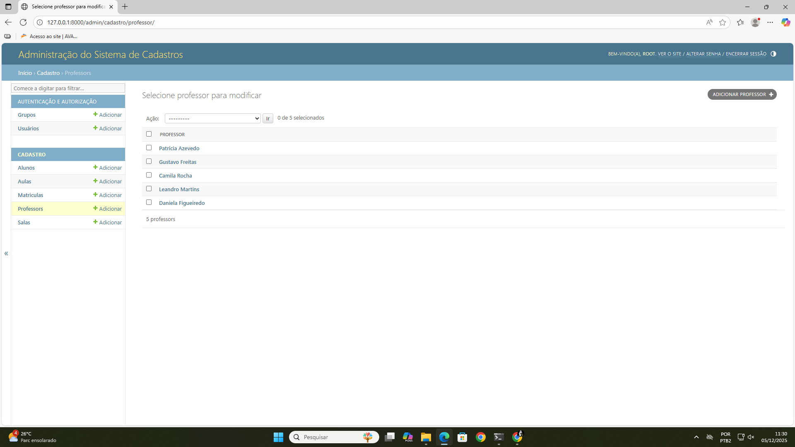
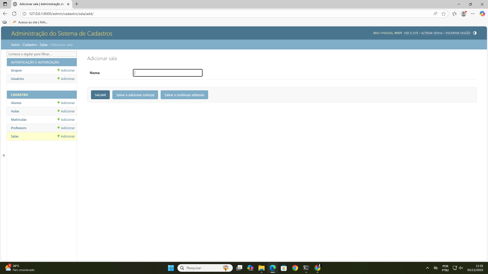
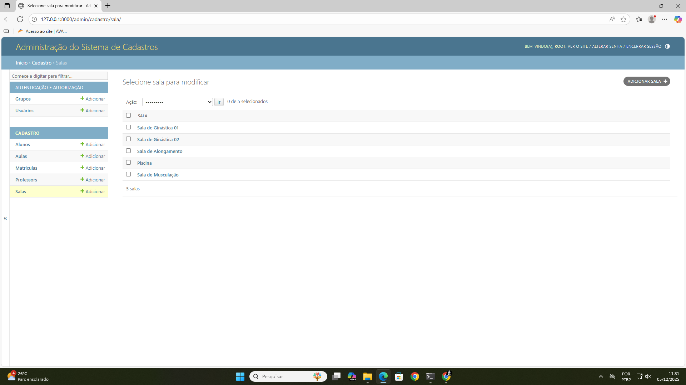
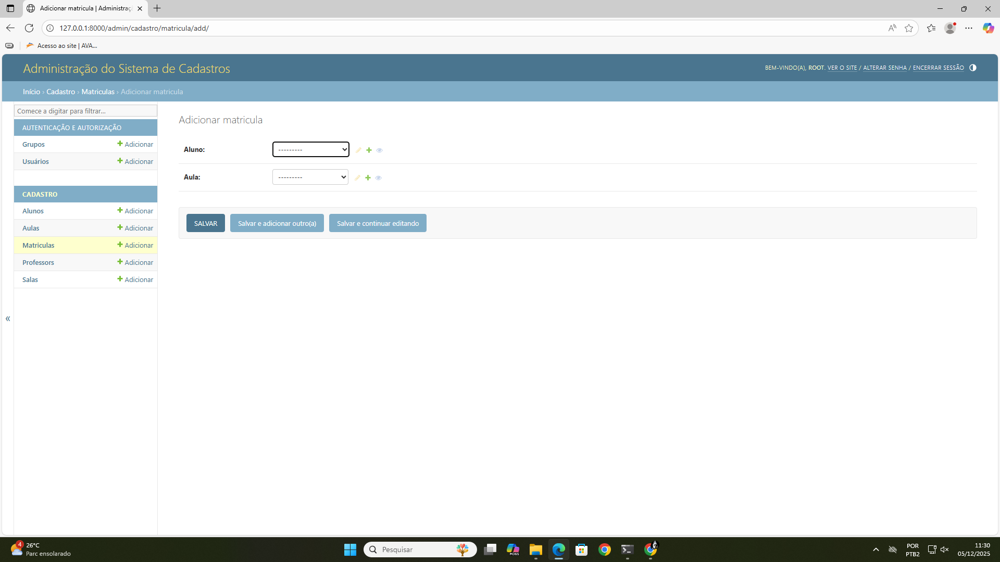
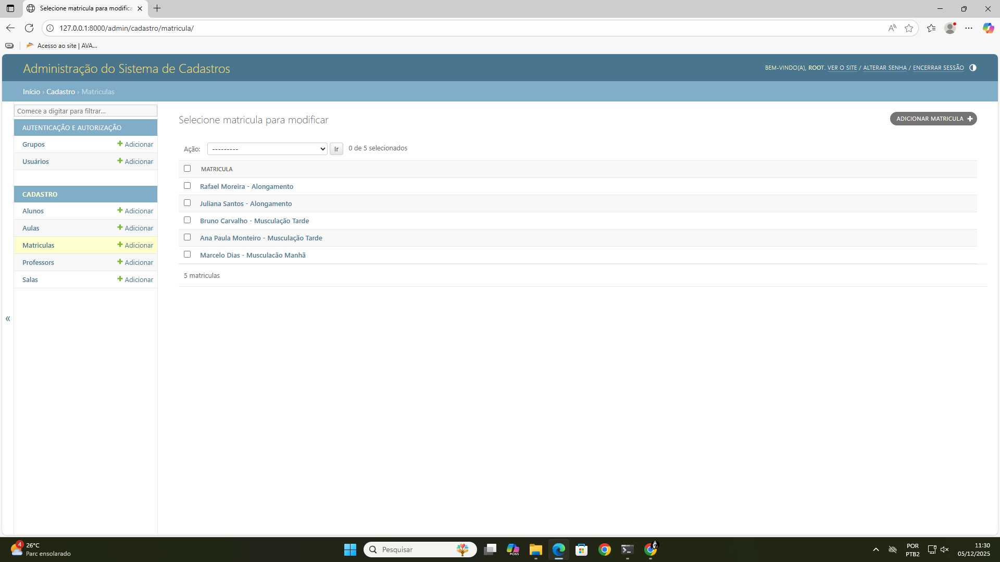

## Nomes dos Integrantes:  
Caio Correa, João Cabrera, Lucas Miranda, Marlon Rosa, Ruimar Silvano, Victor Merling

## Descrição do Projeto:  
Usando o modelo sugerido de Cursos e Alunos, e inspirados pelo nosso Projeto Integrador, no qual fizemos um site para a Academia Nova Corpore, escolhemos ampliar o conceito e incluir novas Classes de objetos no sistema.  
No Projeto Integrador, usando Javascript, criamos um formulário capaz de cadastrar um Aluno, mas, para atender os requisitos deste projeto aumentamos o número de Classes para cinco. Dessa forma, o sistema passa a contar com as cinco classes finais: Aluno, Professor, Aula, Sala e Matricula.

## Models Criados:  
Aluno -> nome, cpf, altura, peso, data_nascimento, email  
Professor -> nome, cpf, cref, data_nascimento, email  
Sala -> nome  
Aula -> nome, professor, sala  
Matrícula -> aluno, aula  

## Explicando os Modelos:
- Aluno tem nome, cpf (único), altura (em metros, logo um decimal de 2 casas), peso (em quilos), data de nascimento, email (único)  
- Professor tem nome, cpf (único), cref (é a identificação do profissional de educação física. é único), data de nascimento e email (único)  
- Sala tem somente nome. Foi criado para permitir selecionar o local de uma aula usando um menu suspenso (dropdown)  
- Aula tem nome, professor (chave estrangeira que representa quem dá a aula) e sala (chave estrangeira que representa o local em que a aula ocorre)  
- Matricula - Segundo o que aprendemos na aula de Banco de Dados, quando há uma relação Many-to-many entre duas tabelas, é necessário criar uma tabela relacional. Sendo assim, associa um aluno e a aula em que ele está matriculado, através de suas respectivas chaves estrangeiras  
- Os cpf do Aluno e do Professor e o cref do Professor, todos têm exatamente 11 caracteres, então foi importado o módulo django.core.validators, para que se pudesse usar a classe MinLengthValidator que permite exigir que a string tenha um tamanho mínimo.

Todos os modelos tem um método __str__ que retorna o nome da instancia, com exceção de Matricula que retorna o nome do aluno e o nome da aula. Ex: Marcelo - Alongamento  

## Tecnologias Usadas:  
O projeto foi feito usando Python, Django e SQLite 

## Instruções para rodar:  
O projeto ainda é incompleto, mas para rodar é simples:  
1 - Certifique-se que tem Python e Django instalados  
2 - Crie uma pasta e clone o repositorio dentro dessa pasta com o comando  
    git clone https://github.com/vctrmrlng/Django_Projeto_Academia  
3 - Dentro desta pasta há uma pasta chamada Django_Projeto_Academia. Entre na pasta  
4 - Use o comando  
    python manage.py runserver  
5 - Clique no link que aparece ou abra seu browser e vá até o endereço http://127.0.0.1:8000/admin  
6 - Use o login e senha root : root  

## Print das Telas

## Agradecimento  
Caro Prof. William, espero que tenha sido isso que o você queria.  
Obrigado pelos conhecimentos transmitidos, pela paciência e pela dedicação ao longo do semestre. Foi um prazer aprender sob sua orientação.
